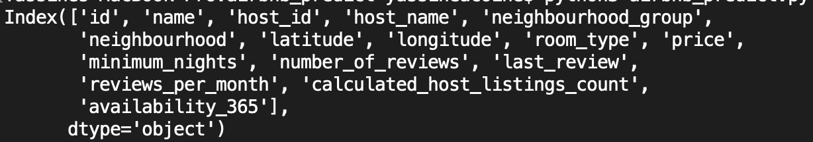
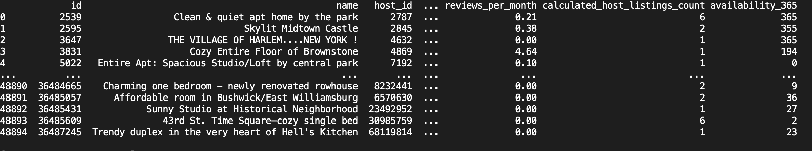
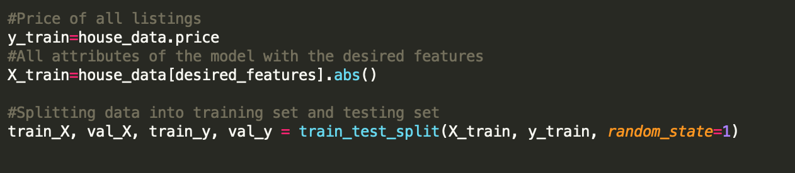
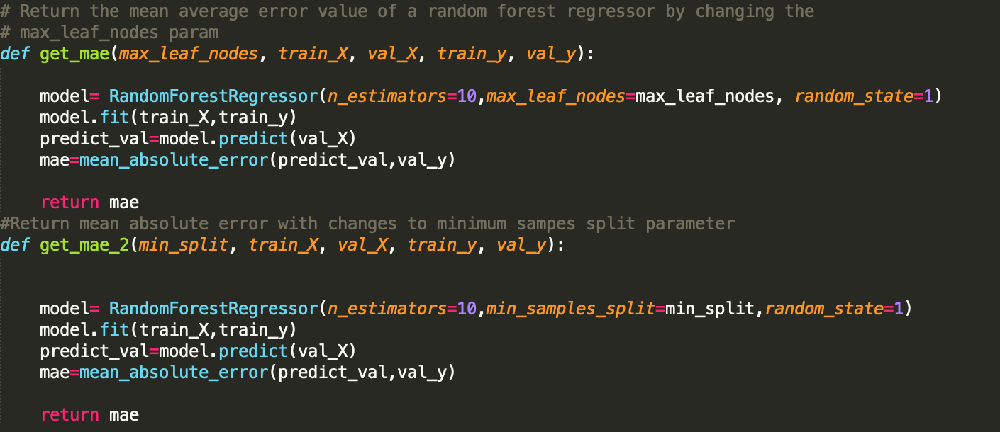
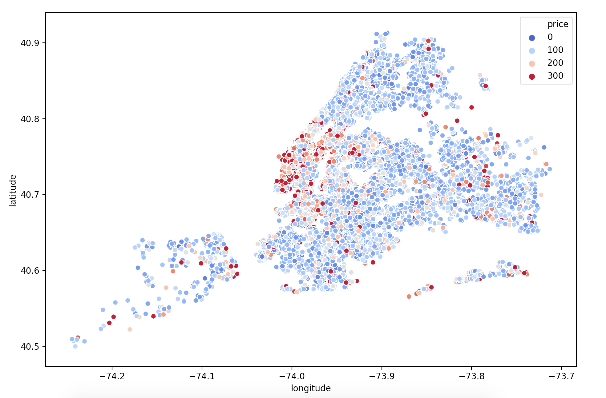
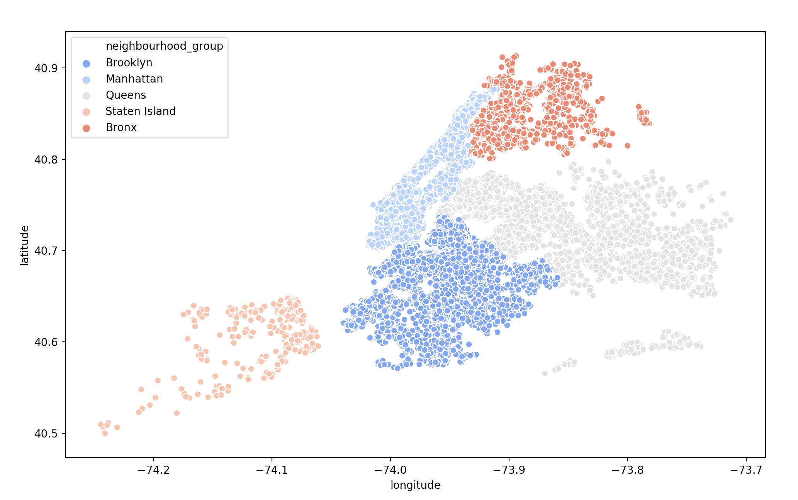
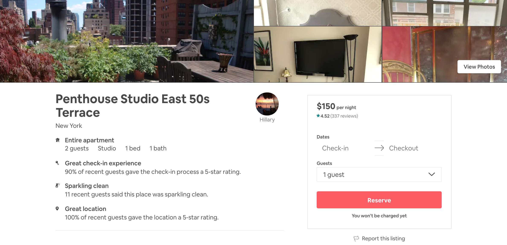
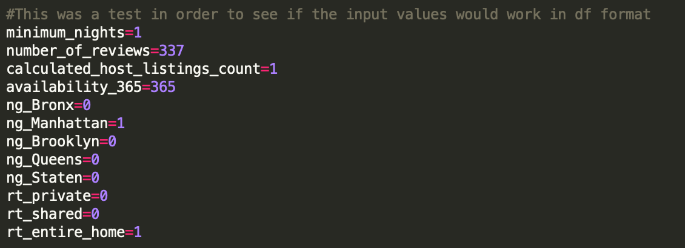

# Airbnb Price Prediction with Random Forest Regressor

## Personal mini-project
**Python3**
## Description

I found a comprehensive airbnb data set for listings in NYC through kaggle (source: https://www.kaggle.com/dgomonov/new-york-city-airbnb-open-data) and I was interested to see if I could apply a random forest regressor for a price prediction.

After many manipulations of the features and the random forest regressor (RFR) attributes, I came up with a pretty solid prediction model based on 6 features and price range. The data-set includes qualitative and quantitative data, said qualitative features have been changed into byte-vectors with one-hot encoding method from pandas library ( get_dummies ). Only valid features have been considered and min_samples_split attrribute of the RFR has been altered because it converges to a better answer in a shorter amount of time.

This price predictive model can be useful for individuals that own airbnb listings and or for individuals interested to see what their listing would be worth. This predictive model in my opinion would be greatly improved if the amount of rooms, number of guests, number of bathrooms, and other quantitative data was offered. However, even with such a restricted number of features, the model still manages to be good, proving the efficiency of RFRs.

## Next Step

Make a comprehensive GUI for inputs. When a user wants to find the predictive price of their listing, they will be able enter feature values of their proposed listing or already existing listing and will be given a price based on the trained model.

The data set uses 48,900 entries, and set model fitting will depend on the price range.

## GUI HELP NEEDED

The basic format of the gui should be:

**HOME PAGE**

Intro to project.

**First Page**

6 input fields.

minimum_night=input("Minimum nights")
number_of_reviews=input("Number of reviews")
reviews_per_month=input("Reviews per month")
calculated_host_listings_count=input("How many listings do you have, inclusive of this one.")
availability_365=input("How many days available per year")

neighbourhood_group=input("Neighbourhood")
Give 5 options for the neighbourhood in button format
o Manhattan, Brooklyn, Bronx, Queens, Staten Island
All values will be equal to 0, unless the button is selected than the value is =1

room_type=input("Room type (1=Entire home/apt, 2=Private room, 3=Share room ")
Give 3 options for the room type in button format
o Entire home/apt, Private room, Shared room
All values will be equal to 0, unless the button is selected than the value is =1

The predictive price result would then be displayed. I have other plots to be displayed but that is in the later works.

***I was also thinking that it would be interesting to not only restrict the price range to sets of
100, but also allow the user to adjust the price range, for example, instead of estimating that the price range of your listing should be 100 to 200, you can tinker with it and put 70-150. The predictive model has no problem with that change, it should just be included with the vars
upper_price_limit & lower_price_limit.***

## Difficulties

The difficulty arise when dealing with the price ranges in NYC because of extreme price range from luxury appartments. However, this is dealt with by specifiying price ranges of appartments and training a dummy model based on the price ranges and not the entire data.

## Code Explained

Data set used comes from https://www.kaggle.com/dgomonov/new-york-city-airbnb-open-data.

Data set is divided by these columns:

The set-up of the data frame looks like this:

The .csv file for the airbnb data has both qualitative and quantitative data, which is not the most ideal when working with random forest regressors, because the qualitative data in itself does not have any mathematical meaning. Hence, it was imperative to change,pick, and choose which of the features would be most ideal order to train our model to predict a listing's price. The most coherent features were taken into consideration. For example; number of total reviews is more important in this case than the number of reviews per month, as it does not add or subtract to the accuracy of the model and only slows down its computation.

In order to take into consideration the qualitative data it was converted to a binary vector using pandas' version of one hot encoder, get_dummies. This allows data such as type of neighbourhood: ["Bronx" , "Brooklyn", "Manhattan"] to be stored as 0's and 1's. Zero if the neighbourhood does not belong and one if it does. This was applied to two qualitative features; the neighbourhood group and the room type: ["Entire apt/home", "Share room", "Private room"].

Method: 
>house_data= pd.get_dummies(data=house_data, columns=['neighbourhood_group','room_type'])

The desired features were then split in order to create a training data set for the model and a test data set.

Two functions were created in order to find the best attribute to change for the RFR.
Forest tree regressor's attribute chosen were max_leaf_nodes, which allocates a maximum amount of leaves per node and min_samples_split, which is the minimum number of samples required to split an internal node. These two functions have a parameter max_leaf_nodes or min_split that allows looping in the main() in order to find the best value, and returns the mean absolute error for that model.

Little graphs:

This graph shows the position of listings with color coded price ranges for values up to $300.

Another fancy graph, that is very much self-explanatory. 

In order to test if the model works, I compared attributes from an actual listing online to what my model would predict.

This is the posting I used to find the price range.

Which resulted in these attributes.

We can also see that as the price range becomes more specific the model converges towards a better answer.

With the above attributes and a model fitted and trained by the .csv file, with min_samples_split=75, n_estimator=10 the model predicted these values;

|               Price range               |         Predicted price          |
| --------------------------------------- | -------------------------------- |
|                  0:400                  |              $225                | 
|                  0:300                  |              $172.52             |
|                  0:200                  |              $145.23             | 
|                  100:200                |              $150.75             | 

With a price range of $100:$200 the prediction of the $150 listing was **$150.75 !!!!**

We can clearly see that as the price range becomes more specific the price prediction becomes more accurate. In this care our prediction was $0.75 off, but the standard deviation was of +/- $25. As the upper and lower limit of price is made more specific the training model is mostly trained with listing in that price range and is able to determine more accurately. 

***Please if you find any errors or whatnot let me know, I am open to all and any comments***
